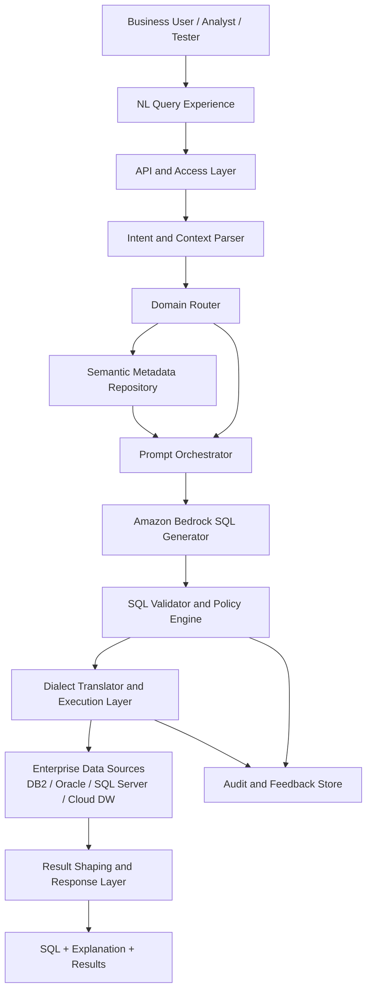

# Bedrock Generic NL2SQL Product Design

## Product Vision

Build a generic enterprise product that converts natural language into governed SQL using Amazon Bedrock. The product must work across lines of business and domains by separating domain knowledge from core generation logic through a metadata-driven semantic layer.

## Core Goal

Enable business users, analysts, testers, and application teams to ask questions in natural language and receive:

- validated SQL
- optional query explanation
- optional result preview
- audit trail for governance

The platform should support multiple domains such as policy, claims, billing, finance, customer, and operations without rebuilding the product for each one.

## Design Principles

- Keep the product generic and metadata-driven.
- Do not expose raw database complexity directly to end users.
- Use Bedrock for translation and reasoning, not as the final authority.
- Validate SQL before execution.
- Restrict generation to approved schemas, tables, columns, and joins.
- Make the platform extensible across databases and lines of business.

## High-Level Architecture

```mermaid
flowchart LR
    A["User Channels<br/>Web UI / API / Chat / Copilot"] --> B["Request Gateway"]
    B --> C["Identity and Access Control"]
    C --> D["Query Understanding Service"]
    D --> E["Domain Router"]
    E --> F["Semantic Metadata Layer"]
    E --> G["Prompt Builder"]
    F --> G
    G --> H["Amazon Bedrock"]
    H --> I["SQL Draft"]
    I --> J["SQL Validation and Guardrails"]
    J --> K["Execution Planner"]
    K --> L["Database Connectors<br/>DB2 / Oracle / SQL Server / PostgreSQL / Snowflake"]
    L --> M["Approved Data Sources"]
    J --> N["Audit, Logging, Feedback Store"]
    K --> N
    M --> O["Result Formatter"]
    O --> P["Response to User"]
```

## Logical Components

### 1. User Channels

Entry points for the product:

- web application
- REST API
- internal chatbot
- enterprise copilots

### 2. Request Gateway

Receives the natural-language request and standardizes it into a common request model. It also attaches user identity, session context, and domain hints.

### 3. Identity and Access Control

Enforces:

- who can ask questions
- which domains they can access
- which datasets and schemas are visible
- row-level and column-level security policies

### 4. Query Understanding Service

Identifies:

- user intent
- requested metrics
- filters
- grouping or aggregation needs
- time dimensions
- output expectations

Example:
"Show active policies in Texas with premium above 1000" becomes a structured intent with measure, dimensions, and filters.

### 5. Domain Router

Determines which semantic model applies. This is what makes the product generic.

Examples:

- policy domain
- claims domain
- billing domain
- finance domain

The router can use:

- explicit user selection
- inferred business vocabulary
- metadata tags

### 6. Semantic Metadata Layer

This is the most important reusable component.

It stores business-friendly definitions for:

- domains
- tables
- columns
- joins
- synonyms
- calculated metrics
- allowed filters
- security classifications
- sample SQL patterns

Example metadata:

- business term: "active policy"
- physical mapping: `policy_status = 'ACTIVE'`
- business term: "written premium"
- physical mapping: `premium_amount`

Because the semantic layer is externalized, the same core engine can work across domains.

### 7. Prompt Builder

Builds a constrained prompt for Bedrock using:

- user question
- selected domain
- allowed schema objects
- join relationships
- SQL dialect
- examples
- output format instructions

The prompt should ask the model to return structured output such as:

- generated SQL
- confidence
- assumptions
- explanation

### 8. Amazon Bedrock

Bedrock generates candidate SQL using a foundation model. It should be used with:

- strict prompt templates
- few-shot examples
- guardrails where relevant
- low temperature for predictable output

### 9. SQL Validation and Guardrails

This layer protects the platform from invalid or unsafe SQL.

Checks include:

- syntax validation
- only `SELECT` statements unless explicitly permitted
- approved schemas only
- blocked keywords such as `DELETE`, `UPDATE`, `DROP`
- join path validation
- column and table allow-listing
- row and column policy enforcement

This layer should reject or repair SQL before execution.

### 10. Execution Planner

Chooses the correct:

- SQL dialect
- connector
- execution limits
- timeout policy
- pagination

It can also run:

- dry-run validation
- explain plan
- sample preview first

### 11. Database Connectors

Provide pluggable support for enterprise data stores:

- DB2
- Oracle
- SQL Server
- PostgreSQL
- Snowflake
- Redshift

This is important for multi-domain and multi-LOB portability.

### 12. Result Formatter

Returns:

- SQL query
- natural-language explanation
- result set preview
- downloadable format
- confidence and assumptions

### 13. Audit, Logging, and Feedback

Captures:

- original prompt
- generated SQL
- validation result
- execution metadata
- user feedback
- approved corrections

This data can be reused for continual improvement.

## Presentation-Ready Architecture Diagram

## End-to-End Flow

1. User submits a natural-language question.
2. The platform identifies intent and domain context.
3. The semantic layer supplies allowed business terms, tables, joins, and SQL dialect rules.
4. The prompt builder creates a constrained generation request.
5. Bedrock produces candidate SQL.
6. Validation checks syntax, access policy, safety, and semantic correctness.
7. Approved SQL is executed against the right data source.
8. Results and SQL explanation are returned to the user.
9. Prompt, SQL, feedback, and telemetry are stored for learning and governance.

## Why This Product Is Generic

The product is reusable because domain-specific behavior is stored in metadata rather than hard-coded into the model workflow.

To onboard a new line of business, the platform mainly needs:

- a new semantic model
- approved joins and metrics
- database connection details
- security policies
- sample prompts and validation rules

The core Bedrock workflow, API layer, UI, validation engine, and audit model remain unchanged.

## Recommended AWS Components

- Amazon Bedrock for SQL generation
- AWS Lambda for orchestration services
- Amazon API Gateway for product APIs
- Amazon Cognito or enterprise SSO for access control
- Amazon DynamoDB or Aurora for metadata and audit storage
- Amazon S3 for logs, feedback datasets, and prompt templates
- AWS Step Functions for multi-step orchestration if needed
- AWS Secrets Manager for database credentials
- Amazon CloudWatch for logging and monitoring

## Security and Governance Controls

- restrict to read-only query patterns by default
- enforce domain-level access controls
- mask or hide sensitive columns
- maintain query audit trails
- support human approval for high-risk datasets
- limit result size and execution time
- require semantic allow-lists instead of open-schema generation

## Product Modules

The product can be packaged into these modules:

1. Query Studio
Natural-language interface for users

2. Semantic Model Manager
Admin tool to define domains, tables, joins, synonyms, and business metrics

3. Policy and Guardrails Engine
Validation, access control, safe SQL generation, and execution policies

4. Connector Hub
Reusable database connectivity layer

5. Observability Console
Audit logs, user feedback, failed query review, and tuning metrics

## Sample User Journey

User input:

"Show total premium by state for active auto policies in the last 12 months"

System behavior:

- route to insurance policy domain
- resolve "total premium" to the approved premium metric
- resolve "active auto policies" to product and status filters
- generate SQL in the correct dialect
- validate tables, joins, and filters
- execute on the approved source
- return SQL, chart-ready result, and explanation

## Future Enhancements

- result visualization
- follow-up conversational refinement
- cross-domain joins through shared business entities
- query recommendation and auto-complete
- feedback-driven prompt optimization
- domain onboarding accelerator

## Suggested Product Positioning

An enterprise natural-language-to-SQL platform powered by Amazon Bedrock that converts business questions into governed, explainable, and executable SQL across domains.
